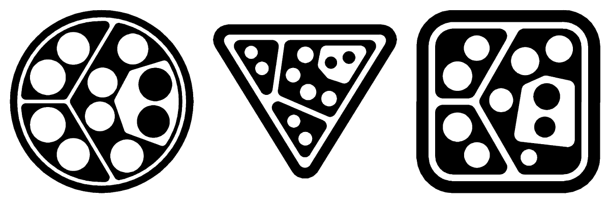

# Seedmarkers - Embeddable Markers for Physical Objects

This is the repository for [Seedmarkers - Embeddable Markers for Physical Objects](https://dl.acm.org/doi/10.1145/3430524.3440645), shape-independent topological markers that can be embedded in physical objects manufactured with common rapid-prototyping techniques. 



## Installation

Install opencv depending on your operating system (for ArUco opencv-contrib is required)  
Install python3 dependencies: `pip3 install -r requirements.txt`

## Quickstart

Install the requirements as stated above and run `generate_example_shapes.sh` in the `generate` directory. 
PNG output can be found in `seedmarker_debug_clear`.

## Manufacturing


Import the generated DXF and extrude the marker. Emboss it in the object and orient this face towards the buildplate when printing. Configure "pause at Z" in your slicing software and let the printer pause and eject filament after the first layer. Change filament and continue.

For lasercutting post-process the DXF (conversion to SVG may be necessary) according to the needs of your lasercutters software package. Sometimes colouring the lines with a certain color is necessary, sometimes manual selection of polygons for engraving needs to be done.

## Applications


 
See the [paper](https://dl.acm.org/doi/10.1145/3430524.3440645) for more details.

## Detection

For 9-DoF pose estimation camera calibration data is required. You can obtain that with openCV and copy the matrices to a JSON file (see `detect/calibration_pixel3a.json` for the structure).
Run `detect/detection_video.sh` for a short demo.

`detect/detection.py --help` will print an overview of the command line arguments.

## Details

### DXF

The generator requires an DXF-file that either contains circles or Polylines. Arcs, splines or other primitives are not supported (polyline-bulges are supported).
Note: there are a few tricks to force Polyline output. Fusion360 will use Polylines if fillets are used at the end of arc-segments.

`python3 generate.py example_shapes/circle.dxf 01232323423 --output circle_marker.dxf`

### ReacTIVision compatibility

If an orientation vector (0-360 deg) and a ReacTIVision amoeba graph is supplied (with or without the leading w/b), the generator will try to arrange the leaves in a way that results in a clear separation between white and black circles. Note that this is more error-prone on complex graphs and outlines. Some geometries will work well, some will terminate early.

See `generate/generate_reactivision.sh`

### Vertical flip

PNGs that are generated are vertically flipped (DXF coordinate system lower left corner, PIL coordinate system upper left corner). If the marker is imprinted using the DXF on the bottom of a 3D printed part the orientation is correct. If the PNG is using for inkjet-printing, vertical mirroring is required.

### 6 DoF pose estimation:

Use a graph that has at least 4 unique subtrees with only a single leaf on the last layer. See `generate/SeedmarkerSpeaker_no_cutout3_marker_print.txt` for an example. The detector requires a OpenCV-style calibration matrix in a JSON-file (see `detect/iphonexs_calibration.json`).

### Troubleshooting:

Depending on the size of the graph or the area of the provided geometry the generator may fail to find a solution. Try decreasing the size of the graph or the minimal line width (append `--line-width=1.0`)

If reading the DXF aborts because no valid geometries could be found, your file may contain splines. Please see the DXF paragraph.

### I want to learn more!:

You can find the open-access paper in the ACM library: [Seedmakers.pdf](https://dl.acm.org/doi/10.1145/3430524.3440645)

If you want to use and cite this work:

```
@inproceedings{10.1145/3430524.3440645,
    author = {Getschmann, Christopher and Echtler, Florian},
    title = {Seedmarkers: Embeddable Markers for Physical Objects},
    year = {2021},
    url = {https://doi.org/10.1145/3430524.3440645},
    doi = {10.1145/3430524.3440645},
    booktitle = {Fifteenth International Conference on Tangible, Embedded, and Embodied Interaction},
    location = {Salzburg, Austria},
    series = {TEI '21}
}
```